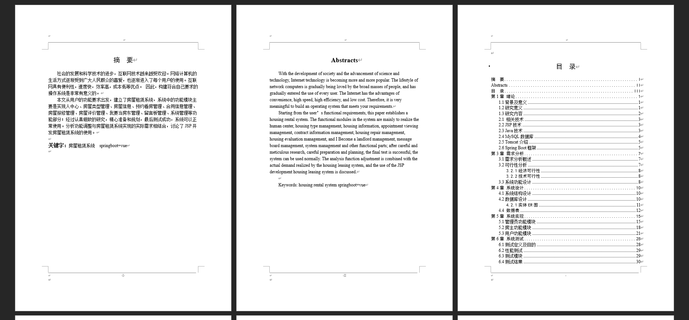
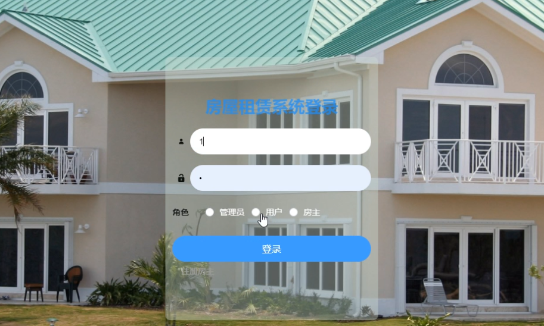
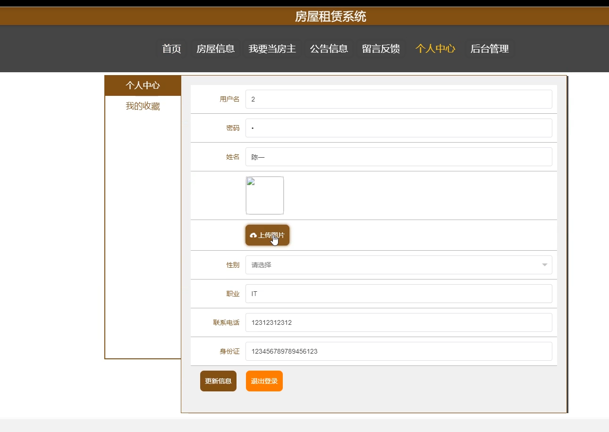
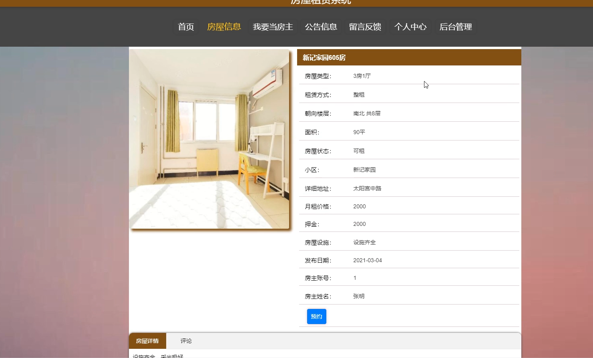
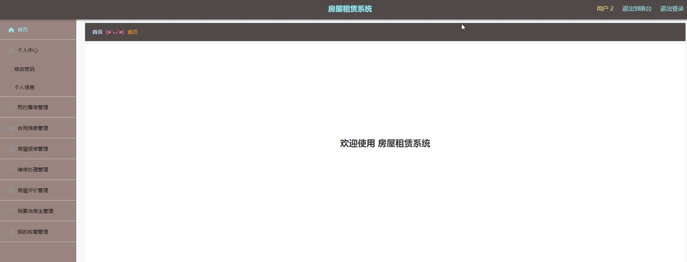
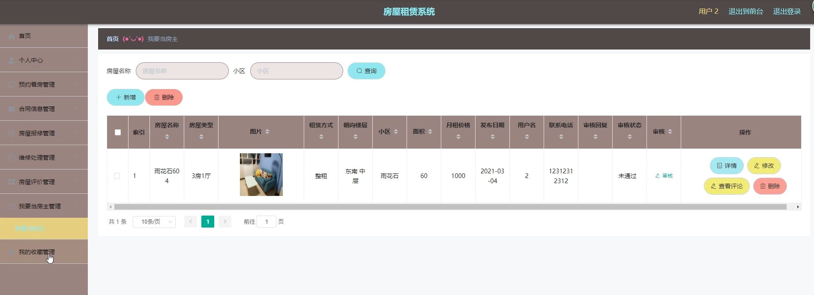
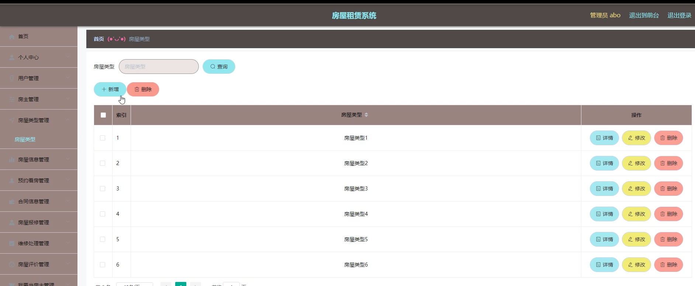
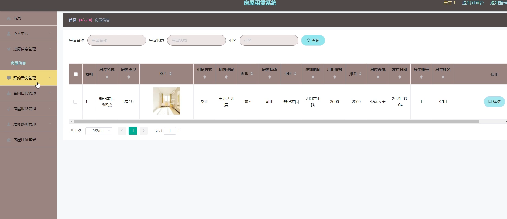

基于SpringBoot的房屋租赁系统（程序+论文）
=
### 完整代码获取地址：从戎源码网 ([https://armycodes.com/](https://armycodes.com/))
### 作者微信：19941326836  QQ：952045282 
### 承接计算机毕业设计、Java毕业设计、Python毕业设计、深度学习、机器学习
### 选题+开题报告+任务书+程序定制+安装调试+论文+答辩ppt 一条龙服务
### 所有选题地址https://github.com/nature924/allProject

一、项目介绍
---
系统包含两种角色：用户、管理员，系统分为前台和后台两大模块，主要功能如下：

### 管理员功能模块
房东管理: 查看、修改、删除和新增房东信息。
房屋类型管理: 查看、修改、删除和新增房屋类型。
房屋信息管理: 查看、修改、删除和新增房屋信息，以及查看和回复评论。
公告信息管理: 查看、修改、删除和新增公告信息。
预约看房管理: 查看、审核和删除预约看房信息。
我要当房东管理: 查看、修改、删除和审核“我要当房东”信息。

### 房东功能模块
信息审批管理: 查看信息审批状态，通过审核后发布房源信息。
房源信息管理: 管理发布的房源信息，发布前需管理员审核。
订单信息管理: 查看并审核用户租房订单，确认支付状态。

### 用户功能模块
房源信息: 查看所有要出租的房源信息，按条件查询。
房源详细信息: 查看房源详细介绍，收藏房源或进行租房操作。
提交租房信息: 提交租房申请，设置申请日期。
订单信息管理: 查看和支付租房订单，确认房东审核状态。

二、项目技术
---
- 编程语言：Java
- 数据库：MySQL
- 项目管理工具：Maven
- 前端技术：VUE、HTML、Jquery、Bootstrap
- 后端技术：Spring、SpringMVC、MyBatis

三、运行环境
---
- 操作系统：Windows、macOS都可以
- JDK版本：JDK1.8以上都可以
- 开发工具：IDEA、Ecplise、Myecplise都可以
- 数据库: MySQL5.7以上都可以
- Tomcat：任意版本都可以
- Maven：任意版本都可以

四、运行截图
---
### 论文截图：

### 程序截图：

